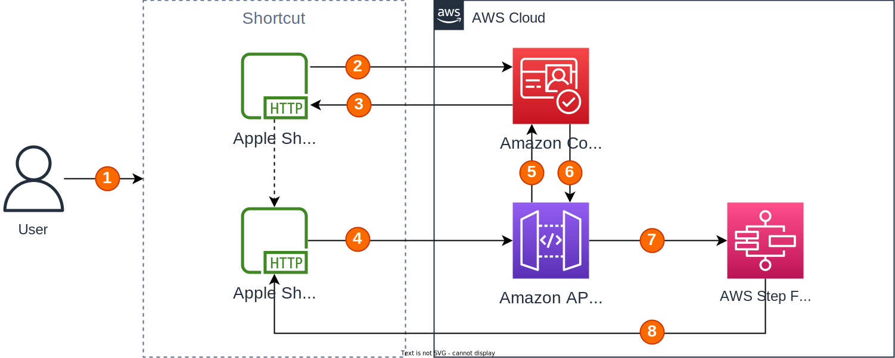

# Apple Shortcuts to API Gateway
Send data securely to Amazon API Gateway using the OAuth Client Credential Flow with Cognito from Apple Shortcuts.

When building a shortcut in the Shortcuts app on an Apple device, it's sometimes necessary to offload processing or exchange data with a cloud provider such as Amazon Web Services (AWS).

This CloudFormation template provisions all the resources required to get started so that you can securely interact with AWS resources from your shortcuts via HTTP.

## How it works



This pattern uses the OAuth Client Credentials Flow (defined in [OAuth 2.0 RFC 6749, section 4.4](https://datatracker.ietf.org/doc/html/rfc6749#section-4.4)) to securely exchange application credentials. 

1. User runs the shortcut.
2. A HTTP POST request is sent to an Amazon Cognito User Pool /oauth2/token endpoint using the "Get contents of URL" action.
3. The Cognito User Pool validates the application credentials and returns an access token to the shortcut.
4. Another "Get contents of URL" action sends a HTTP request to the API Gateway REST API with the access token in the `Authorization` header in the format `Bearer <ACCESS_TOKEN>`.
5. API Gateway sends a request to the Cognito User Pool to validate the token.
6. Cognito User Pool confirms the token is valid and API Gateway proceeds with allowing the request through.
7. API Gateway invokes Step Functions, using the HTTP request body as input for a state machine execution.
8. The output from the state machine is returned to the shortcut.

## Prerequisites
You will need an AWS account and have the AWS CLI and AWS SAM CLI installed.

## Get started

1. Build the stack with [`sam build`](https://docs.aws.amazon.com/serverless-application-model/latest/developerguide/sam-cli-command-reference-sam-build.html).
1. Deploy the stack with [`sam deploy`](https://docs.aws.amazon.com/serverless-application-model/latest/developerguide/sam-cli-command-reference-sam-deploy.html).
1. Test getting an access token.

    Replace the values surrounded by arrows as appropriate (you can get `CLIENT_SECRET` by running the command output by the stack output called `ClientSecretCommand`):

    ```console
    curl --location '<CLOUDFORMATION_OUTPUT:TokenUri>' \
        --header 'Content-Type: application/x-www-form-urlencoded' \
        --data-urlencode 'grant_type=client_credentials' \
        --data-urlencode 'client_id=<CLOUDFORMATION_OUTPUT:ClientId>' \
        --data-urlencode 'client_secret=<CLIENT_SECRET>' \
        --data-urlencode 'scope=shortcuts-api-example/stepfunction:invoke'
    ```